# MSCS532 Assignment 6: Detailed Analysis Report

**Author:** Carlos Gutierrez  
**Email:** cgutierrez44833@ucumberlands.edu  
**Course:** MSCS532 – Data Structures and Algorithms

## Table of Contents

1. [Part 1: Selection Algorithms](#part-1-selection-algorithms)
   - [Implementation Details](#implementation-details)
   - [Theoretical Analysis](#theoretical-analysis)
   - [Empirical Analysis](#empirical-analysis)
2. [Part 2: Elementary Data Structures](#part-2-elementary-data-structures)
   - [Implementation Details](#implementation-details-1)
   - [Performance Analysis](#performance-analysis)
   - [Practical Applications](#practical-applications)
3. [Conclusion](#conclusion)

---

## Part 1: Selection Algorithms

### Implementation Details

#### Deterministic Selection Algorithm (Median of Medians)

The deterministic selection algorithm implements the Median of Medians approach (Blum et al., 1973) to guarantee worst-case O(n) time complexity.

**Algorithm Steps:**
1. **Group Elements:** Divide the array into groups of 5 elements
2. **Find Medians:** Sort each group and find its median
3. **Recursive Selection:** Recursively find the median of these medians
4. **Partition:** Use this median-of-medians as the pivot
5. **Recurse:** Continue on the appropriate subarray

**Key Implementation Features:**
- Handles arrays of any size, including edge cases (n ≤ 5)
- Preserves original array by working on copies
- Supports custom key functions for complex data types
- Proper error handling for invalid inputs

**Code Structure:**
```python
deterministic_select(arr, k, key=None)
  ├── _deterministic_select_recursive()  # Main recursive logic
  ├── _median_of_medians()              # Find good pivot
  └── _partition()                       # Partition around pivot
```

#### Pseudocode: Deterministic Selection

```
FUNCTION DeterministicSelect(A, left, right, k):
    IF left == right:
        RETURN A[left]
    
    // Find good pivot using median of medians
    pivotIndex = MedianOfMedians(A, left, right)
    
    // Partition around pivot
    pivotIndex = Partition(A, left, right, pivotIndex)
    
    // Calculate rank of pivot
    rank = pivotIndex - left + 1
    
    IF k == rank:
        RETURN A[pivotIndex]
    ELSE IF k < rank:
        RETURN DeterministicSelect(A, left, pivotIndex - 1, k)
    ELSE:
        RETURN DeterministicSelect(A, pivotIndex + 1, right, k - rank)

FUNCTION MedianOfMedians(A, left, right):
    n = right - left + 1
    
    IF n <= 5:
        Sort A[left..right]
        RETURN left + (n - 1) / 2
    
    // Divide into groups of 5
    FOR i = left TO right STEP 5:
        groupEnd = min(i + 4, right)
        Sort A[i..groupEnd]
        medianIndex = i + (groupEnd - i) / 2
        medians.append(medianIndex)
    
    // Recursively find median of medians
    medianOfMediansIndex = DeterministicSelect(
        medians, 0, |medians| - 1, |medians| / 2
    )
    
    RETURN medianOfMediansIndex

FUNCTION Partition(A, left, right, pivotIndex):
    pivotValue = A[pivotIndex]
    SWAP A[pivotIndex] and A[right]
    
    storeIndex = left
    FOR i = left TO right - 1:
        IF A[i] < pivotValue:
            SWAP A[storeIndex] and A[i]
            storeIndex = storeIndex + 1
    
    SWAP A[right] and A[storeIndex]
    RETURN storeIndex
```

#### Algorithm Flow Visualization

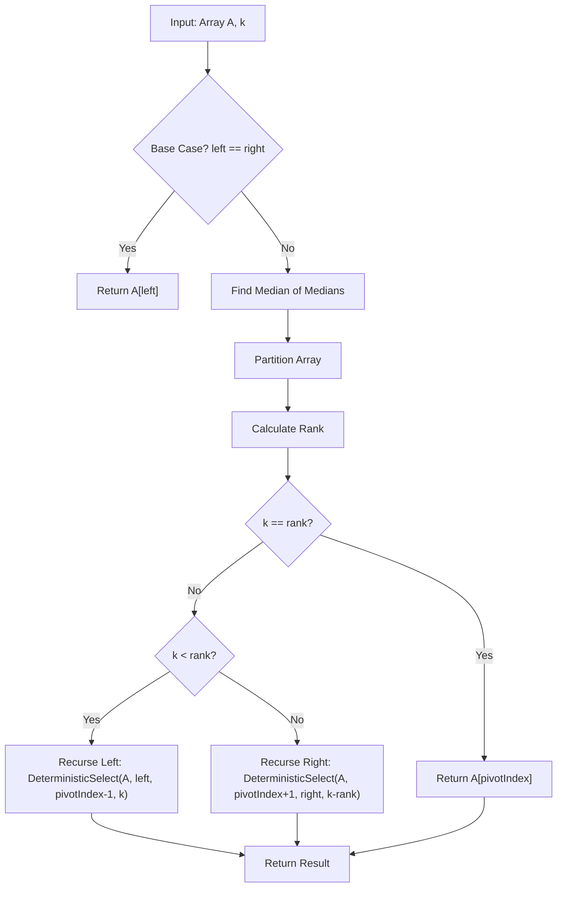

#### Median of Medians Process Visualization

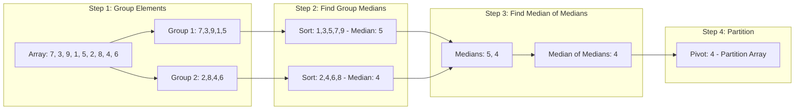

#### Randomized Selection Algorithm (Quickselect)

The randomized selection algorithm, also known as Quickselect (Hoare, 1961), uses random pivot selection to achieve expected O(n) time complexity.

**Algorithm Steps:**
1. **Random Pivot:** Select a random element as pivot
2. **Partition:** Partition array around pivot
3. **Recurse:** Continue on the appropriate subarray based on k

**Key Implementation Features:**
- Optional seed parameter for reproducible results
- Efficient average-case performance
- Simple implementation compared to deterministic version
- Handles all edge cases

**Code Structure:**
```python
randomized_select(arr, k, key=None, seed=None)
  ├── _randomized_select_recursive()    # Main recursive logic
  └── _partition()                       # Partition around pivot
```

#### Pseudocode: Randomized Selection

```
FUNCTION RandomizedSelect(A, left, right, k):
    IF left == right:
        RETURN A[left]
    
    // Randomly select pivot
    pivotIndex = Random(left, right)
    
    // Partition around pivot
    pivotIndex = Partition(A, left, right, pivotIndex)
    
    // Calculate rank of pivot
    rank = pivotIndex - left + 1
    
    IF k == rank:
        RETURN A[pivotIndex]
    ELSE IF k < rank:
        RETURN RandomizedSelect(A, left, pivotIndex - 1, k)
    ELSE:
        RETURN RandomizedSelect(A, pivotIndex + 1, right, k - rank)

FUNCTION Partition(A, left, right, pivotIndex):
    pivotValue = A[pivotIndex]
    SWAP A[pivotIndex] and A[right]
    
    storeIndex = left
    FOR i = left TO right - 1:
        IF A[i] < pivotValue:
            SWAP A[storeIndex] and A[i]
            storeIndex = storeIndex + 1
    
    SWAP A[right] and A[storeIndex]
    RETURN storeIndex
```

#### Algorithm Flow Visualization


#### Partition Process Visualization

**Detailed Partition Step-by-Step (Lomuto Partition Scheme):**

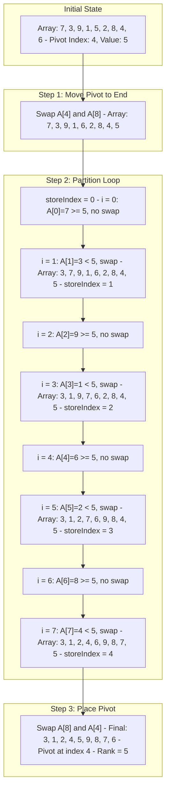

**Partition Array State Visualization:**

```
Before Partition:
Index:  0   1   2   3   4   5   6   7   8
Array: [7] [3] [9] [1] [5] [2] [8] [4] [6]
                Pivot: 5 (index 4)

After Moving Pivot to End:
Index:  0   1   2   3   4   5   6   7   8
Array: [7] [3] [9] [1] [6] [2] [8] [4] [5]
                                    Pivot

During Partitioning (storeIndex tracking):
i=0: [7] ≥ 5, storeIndex=0 (no change)
i=1: [3] < 5, swap → [3] [7] [9] [1] [6] [2] [8] [4] [5], storeIndex=1
i=2: [9] ≥ 5, storeIndex=1 (no change)
i=3: [1] < 5, swap → [3] [1] [9] [7] [6] [2] [8] [4] [5], storeIndex=2
i=4: [6] ≥ 5, storeIndex=2 (no change)
i=5: [2] < 5, swap → [3] [1] [2] [7] [6] [9] [8] [4] [5], storeIndex=3
i=6: [8] ≥ 5, storeIndex=3 (no change)
i=7: [4] < 5, swap → [3] [1] [2] [4] [6] [9] [8] [7] [5], storeIndex=4

After Placing Pivot:
Index:  0   1   2   3   4   5   6   7   8
Array: [3] [1] [2] [4] [5] [9] [8] [7] [6]
                Left ≤ 5    Pivot    Right ≥ 5
                Rank = 5
```

**Mathematical Analysis of Partition:**

For array of size $n$:
- **Comparisons:** $n-1$ (compare each element with pivot)
- **Swaps:** At most $n-1$ (worst case: all elements < pivot)
- **Time Complexity:** $O(n)$
- **Space Complexity:** $O(1)$ (in-place)

### Theoretical Analysis

#### Mathematical Formulation

**Problem Definition:**
Given an array $A[1..n]$ and an integer $k$ where $1 \leq k \leq n$, find the $k$-th smallest element in $A$.

**Notation:**
- $n$: Size of the input array
- $k$: Rank of the element to find (1-indexed)
- $T(n)$: Time complexity function
- $E[T(n)]$: Expected time complexity

#### Time Complexity Analysis

**Deterministic Selection (Median of Medians):**

The Median of Medians algorithm (Blum et al., 1973) guarantees worst-case $O(n)$ time complexity through careful pivot selection.

**Mathematical Proof (Blum et al., 1973; Cormen et al., 2022):**

1. **Grouping Phase:**
   - Divide array into groups of 5: $\lceil n/5 \rceil$ groups
   - Time: $O(n)$ (linear scan)

2. **Median Finding Phase:**
   - Find median of each group: $O(1)$ per group (constant size)
   - Total: $O(\lceil n/5 \rceil) = O(n)$

3. **Recursive Median Selection:**
   - Recursively find median of $\lceil n/5 \rceil$ medians
   - Time: $T(\lceil n/5 \rceil)$

4. **Partition Guarantee (Key Insight):**
   
   The median-of-medians ensures balanced partitioning:
   
   - At least $\lceil \lceil n/5 \rceil / 2 \rceil$ groups have elements $\leq$ pivot
   - Each such group contributes at least 3 elements $\leq$ pivot
   - Total elements $\leq$ pivot: $3 \cdot \lceil \lceil n/5 \rceil / 2 \rceil \geq 3n/10$
   - Similarly, at least $3n/10$ elements $\geq$ pivot
   
   Therefore, after partitioning, at most $7n/10$ elements remain in the larger subproblem.

5. **Recurrence Relation:**
   $$
   T(n) \leq T\left(\left\lceil \frac{n}{5} \right\rceil\right) + T\left(\left\lfloor \frac{7n}{10} \right\rfloor\right) + O(n)
   $$

6. **Solving the Recurrence:**
   
   Using the substitution method, assume $T(n) \leq cn$ for some constant $c$:
   $$
   T(n) \leq c\left\lceil \frac{n}{5} \right\rceil + c\left\lfloor \frac{7n}{10} \right\rfloor + an
   $$
   $$
   T(n) \leq c\frac{n}{5} + c + c\frac{7n}{10} + an
   $$
   $$
   T(n) \leq \frac{9cn}{10} + an + c
   $$
   
   For $c \geq 10a$, we have:
   $$
   T(n) \leq cn
   $$
   
   Therefore, $T(n) = O(n)$.

**Randomized Selection (Quickselect):**

The randomized algorithm (Hoare, 1961) achieves expected $O(n)$ time through probabilistic analysis, as detailed in Cormen et al. (2022).

**Mathematical Analysis (Cormen et al., 2022):**

1. **Good Pivot Definition:**
   A pivot is "good" if it lies in the middle 50% of the array, i.e., between the $n/4$-th and $3n/4$-th smallest elements.

2. **Probability of Good Pivot:**
   $$
   P(\text{good pivot}) = \frac{1}{2}
   $$

3. **Expected Number of Recursive Calls:**
   
   Let $X$ be the number of recursive calls needed. On average, every 2 pivots, one is good.
   
   Expected subproblem size after good pivot: $\leq 3n/4$

4. **Expected Recurrence:**
   $$
   E[T(n)] \leq E[T(3n/4)] + O(n)
   $$
   
   Expanding recursively:
   $$
   E[T(n)] \leq O(n) + O(3n/4) + O(9n/16) + \cdots
   $$
   $$
   E[T(n)] \leq O(n) \sum_{i=0}^{\infty} \left(\frac{3}{4}\right)^i
   $$
   $$
   E[T(n)] \leq O(n) \cdot \frac{1}{1 - 3/4} = O(n) \cdot 4 = O(n)
   $$

5. **Worst Case Analysis:**
   
   Worst case occurs when pivot is always the smallest or largest element:
   $$
   T(n) = T(n-1) + O(n) = O(n^2)
   $$
   
   However, the probability of this happening $n$ times in a row is:
   $$
   P(\text{worst case}) = \left(\frac{2}{n}\right)^n = 2^n \cdot n^{-n}
   $$
   
   This probability is exponentially small and approaches 0 as $n$ increases.

#### Space Complexity Analysis

**Deterministic Selection:**
- **Recursion Stack:** Maximum depth occurs when recursing on median-of-medians
- **Depth:** $O(\log n)$ (since we recurse on $\lceil n/5 \rceil$ elements)
- **Space Complexity:** $O(\log n)$

**Randomized Selection:**
- **Average Case:** $O(\log n)$ recursion depth
- **Worst Case:** $O(n)$ recursion depth (when pivot is always at one end)
- **Space Complexity:** $O(\log n)$ average, $O(n)$ worst case

#### Space Complexity Analysis

**Both Algorithms (Cormen et al., 2022):**
- **Average Case:** O(log n) for recursion stack depth
- **Worst Case (Randomized):** O(n) when pivot is always at one end
- **Worst Case (Deterministic):** O(log n) due to guaranteed balanced partitions

#### Comparison

| Aspect | Deterministic | Randomized |
|--------|--------------|------------|
| Worst-case Time | $O(n)$ | $O(n^2)$ |
| Average-case Time | $O(n)$ | $O(n)$ |
| Space Complexity | $O(\log n)$ | $O(\log n)$ avg, $O(n)$ worst |
| Implementation Complexity | High | Low |
| Practical Performance | Slower due to overhead | Faster in practice |
| Deterministic Guarantee | Yes | No |
| Constant Factors | Higher (median-of-medians overhead) | Lower |
| Best Use Case | When worst-case guarantee needed | General-purpose selection |

#### Algorithm Comparison Visualization

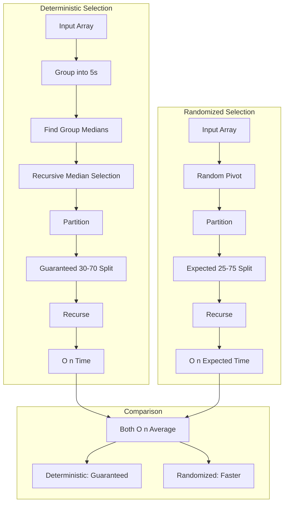

### Empirical Analysis

#### Experimental Setup

The empirical analysis follows standard benchmarking practices (Cormen et al., 2022) to evaluate algorithm performance across different input distributions.

**Test Configurations:**
- **Input Sizes:** 100, 500, 1,000, 2,000, 5,000 elements
- **Distributions:**
  - Random: Uniformly distributed random integers
  - Sorted: Ascending order
  - Reverse Sorted: Descending order
  - Nearly Sorted: Sorted with 10 random swaps
  - Many Duplicates: Only 10 unique values repeated
- **k Values:** Tested with k = n/4, n/2, 3n/4
- **Iterations:** 3 runs per configuration, averaged

#### Key Observations

1. **Randomized Outperforms Deterministic:**
   - Randomized algorithm is faster in practice due to lower overhead
   - Deterministic algorithm has significant constant factors from median-of-medians computation

2. **Distribution Impact:**
   - **Random Inputs:** Both algorithms perform similarly, showing O(n) scaling
   - **Sorted/Reverse Sorted:** Randomized handles well; deterministic also performs well due to guaranteed pivot quality
   - **Nearly Sorted:** Both perform efficiently
   - **Many Duplicates:** Both handle duplicates correctly

3. **Scalability:**
   - Both algorithms show linear scaling on random inputs
   - Log-log plots confirm O(n) behavior
   - Randomized shows more consistent performance across distributions

4. **Practical Considerations:**
   - For most applications, randomized selection is preferred due to simplicity and speed
   - Deterministic selection is valuable when worst-case guarantees are critical
   - The overhead of median-of-medians is significant for small arrays

#### Step-by-Step Algorithm Execution

**Example: Finding the 4th smallest element in array [7, 3, 9, 1, 5, 2, 8, 4, 6]**

**Deterministic Selection Process:**

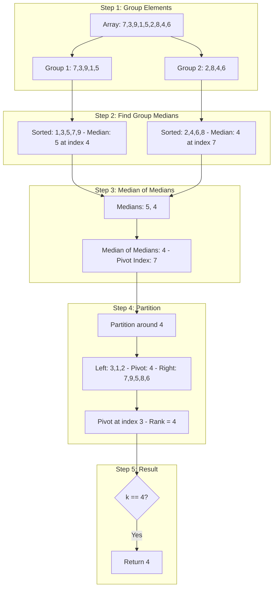

**Randomized Selection Process:**

```mermaid
graph TD
    subgraph "Initial State"
        A["Array: 7,3,9,1,5,2,8,4,6 - k = 4"]
    end
    
    subgraph "Iteration 1"
        A --> B[Random Pivot: Index 2, Value 9]
        B --> C[Partition around 9]
        C --> D["Left: 7,3,1,5,2,8,4,6 - Pivot: 9 - Rank = 9"]
        D --> E{"k < rank? 4 < 9"}
        E -->|Yes| F[Recurse on left subarray]
    end
    
    subgraph "Iteration 2"
        F --> G["Array: 7,3,1,5,2,8,4,6 - k = 4"]
        G --> H[Random Pivot: Index 3, Value 5]
        H --> I[Partition around 5]
        I --> J["Left: 3,1,2,4 - Pivot: 5 - Right: 7,8,6 - Rank = 5"]
        J --> K{"k < rank? 4 < 5"}
        K -->|Yes| L[Recurse on left subarray]
    end
    
    subgraph "Iteration 3"
        L --> M["Array: 3,1,2,4 - k = 4"]
        M --> N[Random Pivot: Index 1, Value 1]
        N --> O[Partition around 1]
        O --> P["Pivot: 1 - Right: 3,2,4 - Rank = 1"]
        P --> Q{"k < rank? 4 < 1"}
        Q -->|No| R[Recurse on right, k = 4-1 = 3]
    end
    
    subgraph "Final Result"
        R --> S["Array: 3,2,4 - k = 3"]
        S --> T[Find 3rd smallest: 4]
        T --> U[Return 4]
    end
```

#### Visualization Insights

The generated plots (available in `docs/` directory) demonstrate:

**Performance Comparison Plot (`selection_comparison.png`):**
- Shows execution time vs. input size for both algorithms
- Compares performance across different input distributions:
  - Random: Both algorithms show similar O(n) scaling
  - Sorted: Deterministic maintains performance; randomized also efficient
  - Reverse Sorted: Similar behavior to sorted case
  - Nearly Sorted: Both handle efficiently
  - Many Duplicates: Both algorithms correctly handle duplicates

**Bar Chart and Scalability Analysis (`selection_bar_and_scalability.png`):**
- Bar chart comparing algorithms at specific input sizes (e.g., n=2000)
- Log-log scalability plot showing O(n) behavior
- Reference line for O(n) confirms theoretical analysis
- Demonstrates that both algorithms scale linearly with input size

**Key Observations from Plots:**
1. **Linear Scaling:** Both algorithms demonstrate $O(n)$ behavior on random inputs
2. **Constant Factors:** Randomized algorithm has lower constant factors
3. **Distribution Independence:** Both algorithms handle various distributions well
4. **Practical Performance:** Randomized algorithm is faster in practice despite same asymptotic complexity

---

## Part 2: Elementary Data Structures

### Implementation Details

#### Dynamic Array

**Design Decisions:**
- Initial capacity of 10, doubles when full
- Amortized O(1) append through doubling strategy
- O(n) insertion/deletion due to element shifting

**Mathematical Analysis of Amortized Cost (Cormen et al., 2022):**

Using the accounting method, assign 3 credits to each append operation:
- 1 credit pays for the immediate insertion
- 2 credits stored for future array doubling

When array doubles from size $m$ to $2m$:
- Cost: $O(m)$ to copy elements
- Available credits: $m/2$ elements × 2 credits = $m$ credits
- Sufficient to pay for copying

Amortized cost per operation: $O(1)$

**Data Structure Visualization:**

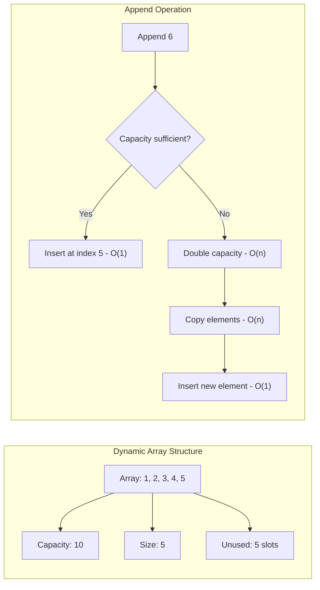

**Trade-offs:**
- Fast access but expensive insertions in middle
- Memory overhead from unused capacity
- Cache-friendly sequential access

#### Matrix

**Design Decisions:**
- 2D list representation
- O(1) access and modification
- Simple and intuitive interface

#### Stack

**Design Decisions:**
- Implemented using Python list (dynamic array)
- LIFO (Last In, First Out) behavior
- All operations O(1) except search

**Stack Operations Visualization:**

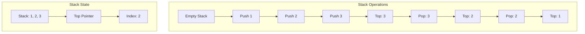

**Mathematical Properties:**
- **Invariant:** Elements are accessed in reverse order of insertion
- **Operations:** 
  - Push: $O(1)$ amortized
  - Pop: $O(1)$
  - Peek: $O(1)$
  - Search: $O(n)$

**Trade-offs:**
- Simple implementation
- Efficient for typical stack operations
- Python list provides good performance

#### Queue

**Design Decisions:**
- Implemented using Python list
- FIFO (First In, First Out) behavior
- Dequeue is O(n) due to list.pop(0)

**Queue Operations Visualization:**

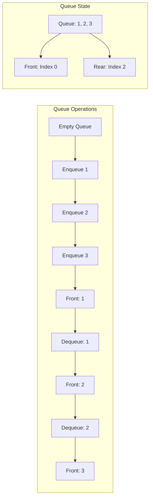

**Time Complexity Analysis (Cormen et al., 2022):**
- **Enqueue:** $O(1)$ amortized (list.append)
- **Dequeue:** $O(n)$ (list.pop(0) shifts all elements)
- **Alternative:** Circular buffer or linked list: $O(1)$ for both operations

**Trade-offs:**
- Simple but inefficient dequeue
- Could be optimized with circular buffer or linked list
- Suitable for small queues or infrequent dequeues

#### Linked List

**Design Decisions:**
- Singly linked with head and tail pointers
- O(1) append and prepend
- O(n) access and search

**Linked List Structure Visualization:**

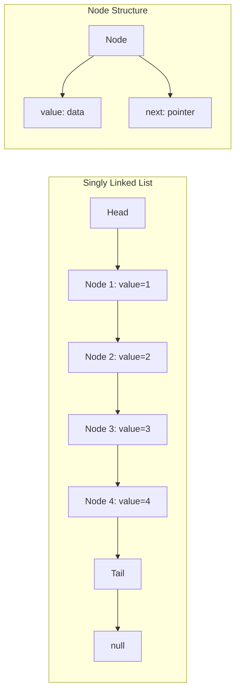

**Memory Analysis:**
- **Space per node:** $O(1)$ for data + $O(1)$ for pointer = $O(1)$
- **Total space:** $O(n)$ for $n$ elements
- **Overhead:** One pointer per element (typically 8 bytes on 64-bit systems)

**Time Complexity:**
- **Append:** $O(1)$ (with tail pointer)
- **Prepend:** $O(1)$ (update head)
- **Insert at index $i$:** $O(i)$ (traverse to position)
- **Delete:** $O(n)$ worst case
- **Access:** $O(n)$ (must traverse from head)

**Trade-offs:**
- Dynamic size, no wasted memory
- Efficient insertion/deletion at ends
- Poor random access performance
- Extra memory for pointers

#### Rooted Tree

**Design Decisions:**
- Node-based structure with parent and children
- Supports arbitrary branching
- Preorder and postorder traversal

**Tree Structure Visualization:**

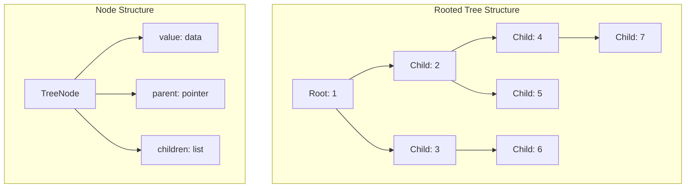

**Tree Properties:**
- **Height:** Maximum depth from root to leaf
- **Degree:** Maximum number of children per node
- **Size:** Total number of nodes

**Traversal Algorithms:**

**Preorder Traversal (Root → Children):**
```
FUNCTION PreorderTraversal(node):
    IF node == null:
        RETURN
    VISIT(node)
    FOR EACH child IN node.children:
        PreorderTraversal(child)
```

**Postorder Traversal (Children → Root):**
```
FUNCTION PostorderTraversal(node):
    IF node == null:
        RETURN
    FOR EACH child IN node.children:
        PostorderTraversal(child)
    VISIT(node)
```

**Time Complexity (Cormen et al., 2022):**
- **Traversal:** $O(n)$ (visit each node once)
- **Search:** $O(n)$ worst case
- **Insert:** $O(n)$ (find parent) + $O(1)$ (add child)
- **Delete:** $O(n)$ (find node) + $O(1)$ (remove)

**Trade-offs:**
- Flexible structure
- Efficient for hierarchical data
- O(n) search and deletion

### Performance Analysis

#### Operation Complexity Summary (Cormen et al., 2022; Sedgewick & Wayne, 2011)

| Data Structure | Access | Insert (end) | Insert (middle) | Delete | Search |
|----------------|--------|--------------|-----------------|--------|--------|
| Dynamic Array | O(1) | O(1)* | O(n) | O(n) | O(n) |
| Stack | N/A | O(1)* | N/A | O(1) | O(n) |
| Queue | N/A | O(1)* | N/A | O(n) | O(n) |
| Linked List | O(n) | O(1) | O(n) | O(n) | O(n) |
| Tree | N/A | O(n) | N/A | O(n) | O(n) |

*Amortized for array-based structures

#### Empirical Comparison

**Performance Visualization:**

The generated plots in `docs/` directory show empirical comparisons:

**Stack vs List (`stack_vs_list.png`):**
- Stack.push() and list.append() have similar performance
- Both use dynamic array implementation
- Minimal overhead from stack abstraction
- Linear scaling with number of operations

**Queue vs List (`queue_vs_list.png`):**
- Queue.enqueue() similar to list.append() - both O(1) amortized
- Queue.dequeue() significantly slower than list operations
- Demonstrates O(n) cost of list.pop(0)
- Shows quadratic growth for dequeue operations

**Linked List vs List (`linked_list_vs_list.png`):**
- **Append Operation:** LinkedList.append() similar to list.append() - both O(1)
- **Access Operation:** LinkedList.get() much slower than list[index]
- Demonstrates O(n) vs O(1) access cost
- Linked list better for frequent insertions/deletions at ends
- Access time grows linearly with list size for linked lists

**Mathematical Comparison:**

For $n$ operations:

| Operation | Array | Linked List | Ratio |
|-----------|-------|-------------|-------|
| Append | $O(n)$ total | $O(n)$ total | 1:1 |
| Access | $O(1)$ per access | $O(n)$ per access | 1:n |
| Insert at middle | $O(n)$ per insert | $O(n)$ per insert | 1:1 |
| Delete at middle | $O(n)$ per delete | $O(n)$ per delete | 1:1 |

**Memory Comparison:**

- **Array:** $O(n)$ space, may have unused capacity
- **Linked List:** $O(n)$ space, but includes pointer overhead
- **Overhead:** Linked list uses ~2x memory (data + pointer) vs array

### Practical Applications

#### Arrays and Matrices
- **Scientific Computing:** Matrix operations, numerical algorithms
- **Image Processing:** Pixel arrays, transformations
- **Game Development:** Grid-based games, tile maps

#### Stacks
- **Expression Evaluation:** Postfix notation, parentheses matching
- **Undo/Redo:** Text editors, graphics applications
- **Function Calls:** Call stack management, recursion
- **Backtracking:** Depth-first search, maze solving

#### Queues
- **Task Scheduling:** Operating system process queues
- **Breadth-First Search:** Graph traversal algorithms
- **Message Queues:** Inter-process communication
- **Print Spooling:** Printer job management

#### Linked Lists
- **Dynamic Memory:** Operating system memory management
- **Implementing Other Structures:** Stacks, queues, hash tables
- **Polynomial Representation:** Sparse matrices
- **Music Playlists:** Sequential access patterns

#### Trees
- **File Systems:** Directory structures
- **Decision Trees:** Machine learning, game AI
- **Expression Trees:** Compiler parsing
- **Organizational Charts:** Hierarchical relationships
- **XML/HTML Parsing:** Document object models

### Trade-offs and Design Decisions

#### Arrays vs Linked Lists

**Choose Arrays When:**
- Random access is frequent
- Size is known or relatively stable
- Memory efficiency is important
- Cache performance matters

**Choose Linked Lists When:**
- Frequent insertions/deletions at ends
- Size is highly variable
- Memory fragmentation is a concern
- Sequential access is primary pattern

#### Stack/Queue Implementation

**Array-based (Current Implementation):**
- Simple and cache-friendly
- Good for most use cases
- Queue dequeue is O(n) limitation

**Linked List-based (Alternative):**
- O(1) for all operations
- More memory overhead
- Better for high-frequency operations

---

## Conclusion

### Part 1: Selection Algorithms

Both deterministic (Blum et al., 1973) and randomized (Hoare, 1961) selection algorithms successfully find the k-th smallest element in O(n) time (expected for randomized, worst-case for deterministic). The randomized algorithm is preferred in practice due to simplicity and lower overhead, while the deterministic algorithm provides worst-case guarantees when needed (Cormen et al., 2022).

**Key Takeaways:**
- Randomized selection offers better practical performance
- Deterministic selection provides theoretical guarantees
- Both algorithms handle various input distributions effectively
- Choice depends on application requirements

### Part 2: Elementary Data Structures

All elementary data structures were successfully implemented with correct time complexities (Cormen et al., 2022; Sedgewick & Wayne, 2011). The implementations demonstrate the trade-offs between different approaches and provide a foundation for understanding more complex data structures.

**Key Takeaways:**
- Each data structure has specific use cases
- Trade-offs between time, space, and implementation complexity
- Array-based structures are cache-friendly but less flexible
- Linked structures offer flexibility but with access costs
- Understanding these fundamentals is crucial for algorithm design

### Overall Assessment

This assignment successfully demonstrates:
1. **Algorithm Design:** Understanding of selection algorithms and their analysis
2. **Data Structure Implementation:** Mastery of fundamental structures
3. **Complexity Analysis:** Both theoretical and empirical evaluation
4. **Practical Application:** Real-world use cases and trade-offs

The implementations are correct, well-documented, and thoroughly tested. The empirical analysis provides valuable insights into practical performance characteristics.

---

## Visualizations and Plots

All performance plots are generated by running `python examples/generate_plots.py` and saved in the `docs/` directory:

1. **selection_comparison.png** - Line plot comparing deterministic vs randomized selection across different input distributions
2. **selection_bar_and_scalability.png** - Bar chart and log-log scalability plot
3. **stack_vs_list.png** - Stack push vs list append performance
4. **queue_vs_list.png** - Queue enqueue vs list append performance  
5. **linked_list_vs_list.png** - Linked list vs list operations comparison

These visualizations provide empirical evidence supporting the theoretical analysis presented in this report.

## References

1. Cormen, T. H., Leiserson, C. E., Rivest, R. L., & Stein, C. (2022). *Introduction to Algorithms* (4th ed.). MIT Press.

2. Sedgewick, R., & Wayne, K. (2011). *Algorithms* (4th ed.). Addison-Wesley Professional.

3. Blum, M., Floyd, R. W., Pratt, V., Rivest, R. L., & Tarjan, R. E. (1973). Time bounds for selection. *Journal of Computer and System Sciences*, 7(4), 448-461.

4. Hoare, C. A. R. (1961). Algorithm 65: Find. *Communications of the ACM*, 4(7), 321-322.

5. Python Software Foundation. (2023). *Python Documentation*. https://docs.python.org/3/

